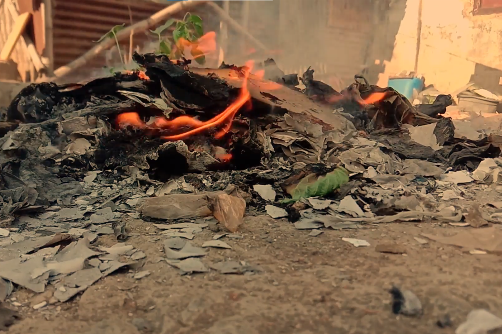
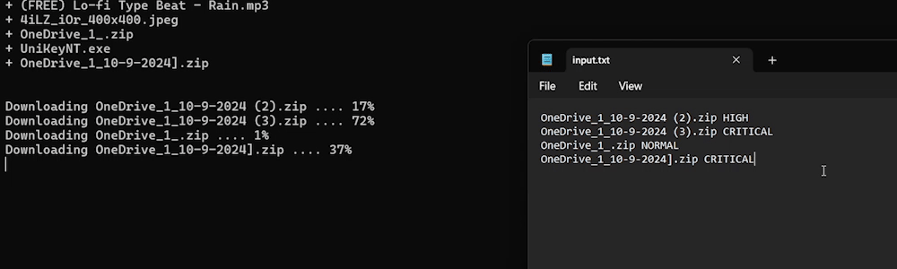

# My Freshman Year

Hi, welcome to my first blog! I've created this website and these (upcoming) blogs for a single purpose: honing my programming skills/knowledge and sharing my experiences as an IT student with a bit of C++ background from high school.
> As the topic of the blog is about my freshman year (that's about 10 months i didn't have a summer break T.T) so this one is gonna be long af.

> Caution: Wall Of Text (tho I'll try to include as many pictures as I can)

> ## How'd I get into HCMUS

So, a little bit about me and how I got into HCMUS. I've always been pretty good at Physics, Math, English, and Informatics (where I learned about Pascal and C++), but I was never really passionate about any of them. That remained the case until grade 12, when I needed to decide on my major. At first, I considered majoring in English Language, as I had already won some English prizes and scored 7.5 on my IELTS. But then I realized I should pursue IT, since it's a high-paying and trending field.\
After deciding on my major, the next question was: **"*Which university?*"** At the time, HCMUT was the only university that came to mind because of its reputation and the number of famous, successful alumni it had. However, after hearing my friends discuss their choices, I learned about HCMUS — one of the top IT universities in the southern region. So I chose it, just like that. :>\
Now comes the part about securing a seat at HCMUS. To be honest, my hopes of getting in were never high. Looking at last year's admission scores for different methods and comparing them with mine, I just wished I had done better in school. I was mentally prepared to go to HCMUT but still left HCMUS as my first aspiration, hoping for a miracle.\
And it happened! One day, while preparing my paperwork for admission to HCMUT, a friend texted me and told me to check the official admission scores. To my surprise, my score was just enough to pass. That's how I magically got into HCMUS.

> ## First Semester

Fast forwarded to my first semester, I got to learn about basics of programming, computers, teamworking and maths through four subjects:
- Introduction to Programming
- Introduction to Information Technology
- Soft Skills
- Discrete Mathematics

Being in my first semester also brought me a lot of firsts:
- First time joining a club
- First time making a short film
- First time failing a course

Yes, you read that right! I failed a course in my first semester. It was the night before the **"*Introduction to Programming*"** final exam, I stayed up late untill 3 a.m, reviewing and preparing a cheatsheet. Then, I hit the sack. Unfortunately, I woke up at 9 a.m., and the exam had started at 7:30 a.m. So, there I was, failing a course just because I overslept (T.T).

It was also the first time I decided to join a club. A funny story: when I filled out the application form, I could apply for up to three different positions in various boards, but I went ahead and filled all three as "Video Editor" because, honestly, that’s what I had been doing and learning for 4–5 years.\
I took a big risk, and it paid off! I got accepted as one of the editors in the multimedia board. Frankly, it's one of the best decision I've ever made. As a club member, I got the chance to meet people my age and even senpais that are extremely talented (I don't know how they get 4.0 GPA, win scholarships and at the same time organizing and running events ** **orz** **).\
Also made a short film as part of the of the **"*Soft Skills*"** course project. Each group was randomly assigned a topic, and my group got **"*Social Responsibilities*"**. It was a pretty vague topic, but I came up with an idea about the environment, which was later developed into the film script. I even played the role of a professor in the movie and took part in the editing process.

> ## Second Semester

Moving on to my second semester, four more subjects appeared:
- Advanced Programming Techniques and Practices
- Calculus 1
- General Physics 1
- General Law

The **"*Advanced Programming Techniques and Practices*"** course gave me the chance to recreate one of the childhood computer games: "**Pikachu**". It's the first time I learn how to use external graphics library and implement game loops. Took me a few head-scratching moments and asking around but I managed to finish it in a week.

During this semester, a big academic competition took place. Instead of registering as a contestant, I applied to be a video editor for the event. It was a fun yet exhausting journey. Along the way, I learned a new skill: *Videography*, greatly improved my *Motion Graphics* skill and made new acquaintances.\
When the semester was about to end, another competition popped up. It was a design contest with three categories: Video, Animation and Comic. At first, when I first saw it on my Facebook newsfeed, I didn't think I would participate. That changed when a friend in my club reached out and asked if I’d join him in the competition. I said yes, and together with a senpai, we entered the contest.\
Since we competed in the Video category, we needed pass the first round by creating a shotlist to *visualize* the story we wanted to tell. Somehow, our shot list got accepted, and we advanced to the second round: Making a short film based on the shotlist. Unfortunately, I wasn’t very involved in this process because I was back in my hometown, leaving all the shooting to my team (veri sorry T.T).\
The final product was somewhat acceptable. Although it still had some issues, we managed to win 2nd place!

> ## Third Semester

In the final semester of the year, although the number of subjects remained unchanged, the difficulty, combined with my stupidity and laziness, was on another level:
- Computer Networking
- Data Structures and Algorithms
- Calculus 2
- Linear Algebra

Learning DSA was fine - except the "*What is this algorithm's complexity?*" part. I had no idea how to determine that (or maybe I'm just dumb). As for Calculus 2 and Linear Algebra, I messed up pretty badly. I paid attention and kept up until the midterm, but after that, I completely lost track and paid a heavy price in the finals, which dragged my total GPA down.\
Computer Networking was the one subject where I had no idea what was going on, but it came with some intriguing projects. For example, I had to create a Server-Client programm for file transferring. That's when I picked up a new programming language - Python - and learn about socket progamming.

> ## Bonus: Military Training

As a student, you are required to participate in military training at least once during your university life. Honestly, the 3.5-week period at the military training center was the most relaxing and healthiest time I’ve had since the start of the year. I stayed in a 12-person room with two clean toilets and access to clean water for showers. We had three meals a day, a small nap at noon, and eight hours of sleep every night. I even started jogging and doing some calisthenics exercises. Woooooo! It doesn’t get any healthier than that.

> ## Wrapping Up

Looking back on my first year at HCMUS, it was a mix of excitement, challenges, and plenty of lessons — both academic and personal. From failing my first course to winning a competition, from improving my video editing skills to grappling with tough subjects like DSA and Networking, every moment shaped me into a more resilient and determined version of myself. I may not have aced everything, but the experiences, the friendships, and the skills I gained are what truly matter. And with that, I’m ready to take on whatever comes next in my journey.
